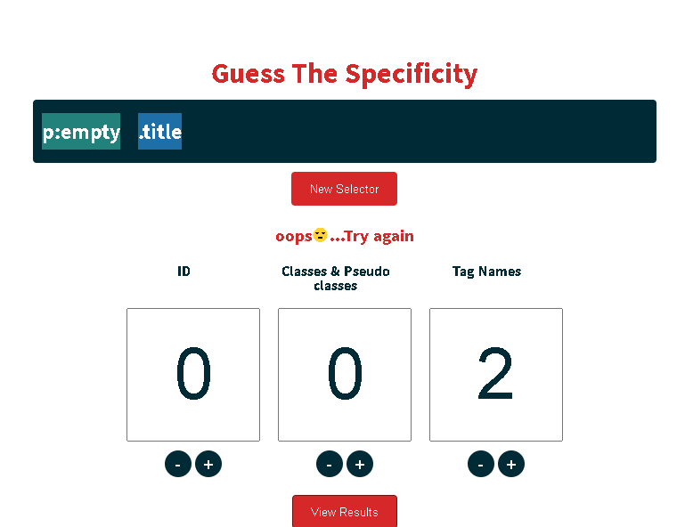
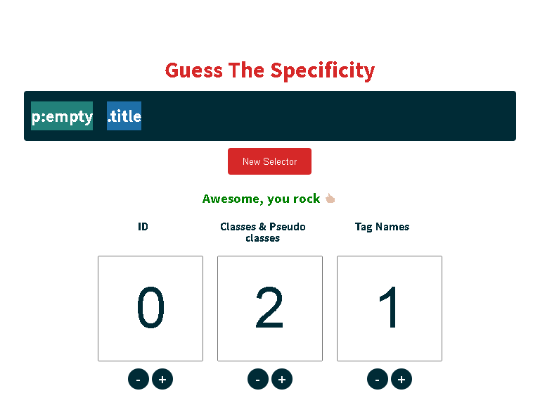

# guess-the-specificity

I wrote an [article](https://dev.to/ibn_abubakre/css-specificity-explained-1134) on dev.to concerning CSS specificity and I decided to come up with the fun game that allows you to test your knowledge of CSS specificity.

The CSS selectors in the game is for educational purposes only and as such might not be the most appropriate.

*To make the CSS selectors more random, you can check the [db folder](https://github.com/Abdulqudus001/guess-the-specificity/tree/master/db) to add more CSS selectors*

Credits to [keeganstreet](https://github.com/keeganstreet/) for his [specificity-calculator](https://github.com/keeganstreet/specificity)

## Todo
 - [x] Generate random CSS selectors
 - [x] Calculate specificity and check score
 - [ ] Random success message
 - [ ] Come up with a better UI
 - [ ] Add extra ids, classes, tags name and pseudo classes
 - [ ] Add support for attribute selectors
 - [ ] Add difficulties
 - [x] Add explanation of how to calculate the specificity

## Project setup

### Install dependencies

* npm: `npm install`
* yarn: `yarn`

### Start Dev Server

* npm: `npm run dev`
* yarn: `yarn dev`

### Build for production and launch server

* npm:
  ```bash
    npm run build
    npm run start
  ```
* yarn:
  ```bash
    yarn build
    yarn start
  ```
For detailed explanation on how things work, check out [Nuxt.js docs](https://nuxtjs.org). -->

## How to Calculate Specificity

To guess the specificity, you just need to count the individual numbers of selectors .

### Example



The answer to the image above would be wrong because we have 1 Tag Name, 1 Class and 1 Pseudo-class. Since the Class and Pseudo-class are grouped together that would make it 2 Class and 1 Tag Name.



My answer is now correct because i guessed it according to the selectors. 😎

